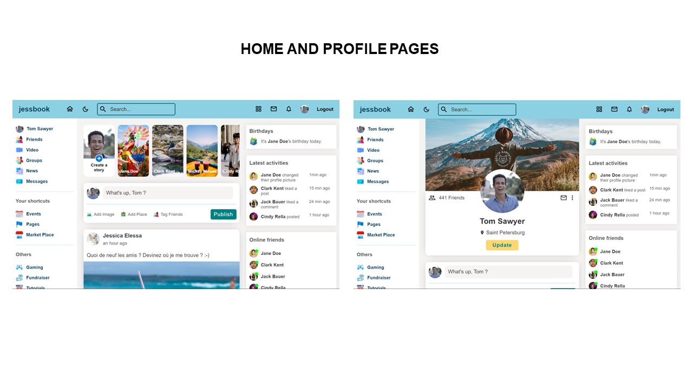

# jessbook

Jessbook is a social media application inspired from Facebook and Twitter that allows users to manage content and interact with other users.

## Table of Contents

- [Demo](#demo)
- [Stack](#stack)
  - [Frontend](#frontend)
  - [Backend](#backend)
- [Screenshots](#screenshots)
- [Main features](#main-features)
- [Setting up the database](#setting-up-the-database)
- [Run the project locally](#run-the-project-locally)
- [Getting started with Vite](#getting-started-with-vite)
- [Contributing](#contributing)
- [Stay Updated](#stay-updated)
- [Contact](#contact)

## Demo

You can see a live demo of the project [here](https://).

## Stack

### Frontend

- The user interface was created with **React** using **Vite** tool for rapid development and **Sass** for styling.

- Client-side data requests, intelligent caching, and loading/error state management were handled using **TanStack Query** (formerly known as **React Query**).

- The application navigation was managed by **React Router**.

### Backend

- The API was built with **Node.js** and **Express**.

- The database queries were performed using **MySQL**.

## Screenshots

## Main features

- Authenticate users with **JWT** an **bcrypt**.
- Allow users to reset their password.
- Enable user to create, update or delete posts.
- Fetch users posts from the backend API and display them on their profile page.
- Facilitate interactions between users with features such as "like" and "follow"/"unfollow".
- Support both dark and light themes for the user interface.

## Setting up the database

Before running the project locally, you will need to set up the database. Follow the following steps :

### 1. Create a MySQL database

If you have not already done so, create a MySQL database for Jessbook. You can do this using MySQL Workbench or any other MySQL database management tool.

### 2. Configure database connection

Update the database connection configuration in the project to match your local MySQL database settings. You can find the database configuration file at the following path : `api/utils/connect.js`.

## Run the project locally

Now that the database is set up, you can run the project locally by following these steps :

1. Open your terminal and navigate to the location where you want the local repository to be copied.
2. Clone the repository : `git clone https://github.com/jesselessa/jessbook.git`.
3. Navigate to the project directory : `cd jessbook`.
4. Inside the project directory :
   - Run the application in development mode : `npm run dev`.
   - Start the server to connect it to the database : `npm start`.
5. Open http://localhost:5173 in your web browser to view the live application.

Make sure to complete the values of the **environment variables** necessary to the project in a `.env` file in order to make it work.

## Getting Started with Vite

[Vite](https://vitejs.dev/) is a fast development tool for modern web applications. To get started with Vite, follow these simple steps :

### 1. Install Node.js and npm

Ensure you have Node.js and npm installed on your system. You can download and install them from the [official Node.js website](https://nodejs.org/en).

### 2. Initialize the project

If you have not already created a project, you can initialize a new project using the following command in your terminal : `npm init vite@latest my-project --template react`.

This command will create a new directory named `my-project` and install a Vite project with a React template in it.

### 3. Install dependencies

Once the project is initialized, navigate to the newly created directory (`cd my-project`) and install the dependencies by running the command `npm install`.

### 4. Start the development server

To start the development server, use the command `npm run dev`.

This will launch Vite and automatically open your default browser to http://localhost:5173, where you can see your live application.

### 5. Deploy to production

To build an optimized version of your application ready for production, use the command `npm run build`.

This will generate a production-ready version of your application in the `dist` directory of your project.

## Contributing

Feel free to make improvements, fix bugs, or suggest new features. Contributions are welcomed !

- Fork the repository and clone it to your local machine : `git clone https://github.com/jesselessa/jessbook.git`.
- Navigate to the project directory : `cd jessbook`.
- Inside the project directory :
  - Install dependencies by running `npm install`.
  - Create a new branch for your feature or bug fix : `git checkout -b my-feature`.
  - Make your changes and ensure that your code follows the project coding style.
  - Test your changes locally.
  - Commit your changes and push them to your forked repository.
- Finally, submit a pull request to the main repository with a clear description of your changes.

## Stay updated

To stay updated with the project latest changes, you can pull them from the repository : `git pull origin main`.

## Contact

For inquiries, you can contact me via [LinkedIn](https://www.linkedin.com/in/jessica-elessa/).

---

&copy; 2024, Jessica ELESSA - All rights reserved
